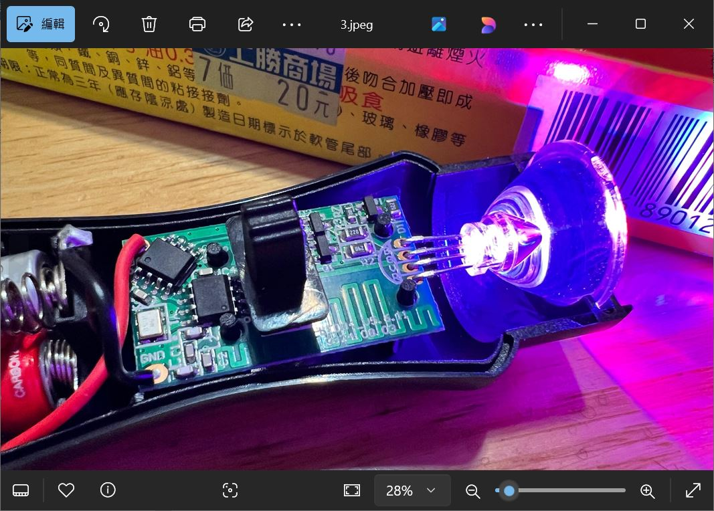
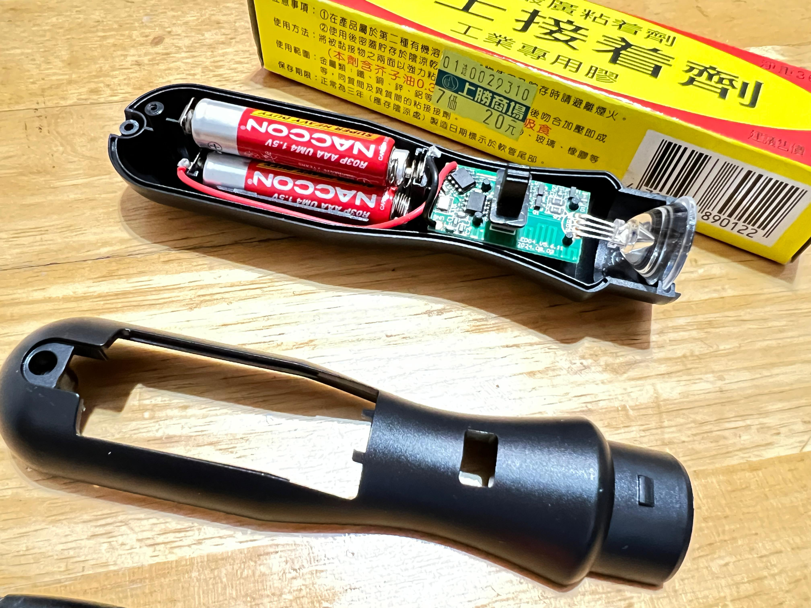
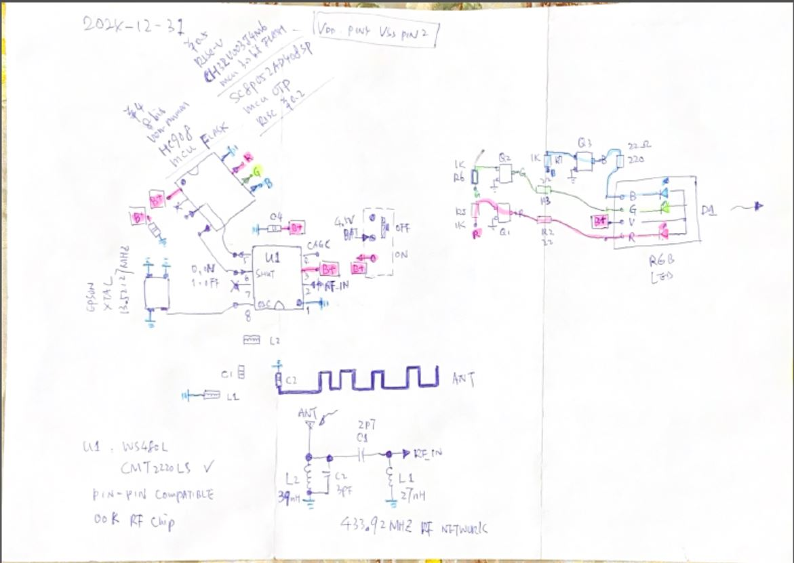

# concert_RGB-litebar.c
RGB LED controlled by RF signal and ASK/OOK message, testing gague

### hardware for testing  
  
  

### circuit diagram of hardware   
[my_schematic.pdf](my_schematic.pdf)  
  

### the code
[concert_RGB_litebar.c](concert_RGB_litebar.c)
